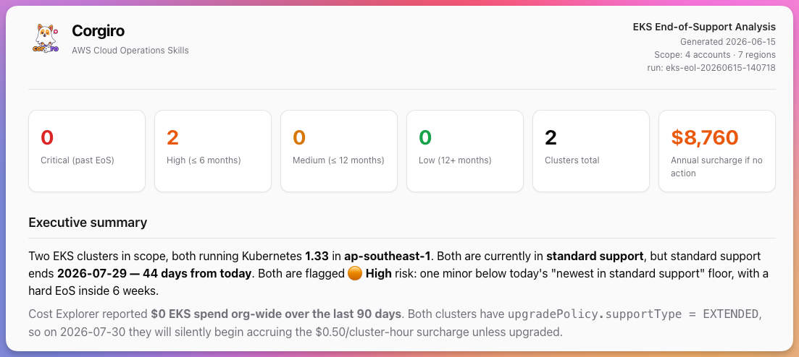

<div align="center">
  

# Corgiro - AWS Cloud Operation Skills

**An AWS TAM's operational playbook, one command away.**

[](LICENSE)
[](#)
[](#)

</div>

Corgiro is an AI agent skill for AWS multi-account cloud operations. One command sweeps your entire AWS Organization, read-only, and returns shareable reports.

Each sweep finds:

- **Account coverage gaps** - which accounts are reachable, newly added, or newly unreachable
- **AWS Health events** - org-wide risk assessment and pattern analysis
- **RDS / Aurora end-of-support** - risk-prioritized upgrade recommendations
- **Amazon EKS end-of-support** - Kubernetes version risk, upgrade paths, extended-support cost
- **EC2 compute hygiene** - instance currency, Graviton eligibility, EBS optimization, utilization

Want the deeper explanation of how it works? See [docs/what-is-corgiro.md](docs/what-is-corgiro.md).



## Quickstart

```bash
# 1. Install the skill
npx skills@latest add aws-samples/sample-corgiro-aws-ops-skills

# 2. One-time setup (sets up access to your AWS accounts)
/corgiro setup-corgiro

# 3. Run a sweep
/corgiro account-coverage
```

## Modes

| Invocation                                                                      | Description                                                                                                                                                                                                                         |
| ------------------------------------------------------------------------------- | ----------------------------------------------------------------------------------------------------------------------------------------------------------------------------------------------------------------------------------- |
| [`/corgiro setup-corgiro`](skills/corgiro/modes/setup-corgiro/)                 | One-time multi-account setup. Choose **Option A** (use existing Identity Center access — no org changes) or **Option B** (org-wide cross-account access — trusted access, delegated admin, StackSet). Saves state to `~/.corgiro/`. |
| [`/corgiro account-coverage`](skills/corgiro/modes/account-coverage/)           | Determine accounts in scope, probe reachability (SSO profile or AssumeRole), produce coverage report.                                                                                                                               |
| [`/corgiro health-event-analysis`](skills/corgiro/modes/health-event-analysis/) | AWS Health Dashboard analysis across your org or assigned accounts — risk assessment, pattern analysis, HTML report.                                                                                                                |
| [`/corgiro rds-eol-analysis`](skills/corgiro/modes/rds-eol-analysis/)           | RDS/Aurora end-of-support analysis — risk-prioritized report with upgrade recommendations.                                                                                                                                          |
| [`/corgiro eks-eol-analysis`](skills/corgiro/modes/eks-eol-analysis/)           | Amazon EKS end-of-support analysis — Kubernetes version risk, upgrade paths, and extended support cost estimates.                                                                                                                   |
| [`/corgiro ec2-compute-review`](skills/corgiro/modes/ec2-compute-review/)       | EC2 operational health assessment — instance type currency, Graviton eligibility, EBS optimization, security, CloudWatch utilization, and snapshot coverage.                                                                        |
| [`/corgiro bedrock-model-lifecycle`](skills/corgiro/modes/bedrock-model-lifecycle/) | Bedrock model lifecycle analysis — identify deprecated or soon-to-be-deprecated models, which accounts still use them, and which inference profiles reference them.                                                              |
| [`/corgiro mode-builder`](skills/corgiro/modes/mode-builder/)                   | Interactive workflow to create custom Corgiro modes for your org — ideation, AWS API discovery, drafting, validation, and testing.                                                                                                  |

## Install

```bash
# Install the skill (interactive)
npx skills@latest add aws-samples/sample-corgiro-aws-ops-skills

# Install globally for Kiro CLI
npx skills@latest add aws-samples/sample-corgiro-aws-ops-skills -g -a kiro-cli -y

# Local development (symlink)
ln -s "$PWD/skills/corgiro" ~/.kiro/skills/corgiro
```

## Requirements

- AWS CLI v2 configured with IAM Identity Center (SSO)
- `~/.corgiro/config.json` (created by `setup-corgiro`)

For **Option B** (org-wide cross-account access) additionally:

- A dedicated tooling account with delegated admin for Health, Security Hub, GuardDuty, Config
- `CorgiroReadOnlyRole` deployed to member accounts via StackSet

Run `/corgiro setup-corgiro` to set up either path.

## Repo Layout

```
skills/
└── corgiro/
    ├── SKILL.md                          ← router (single command)
    ├── references/
    │   ├── cross-account-defaults.md     ← shared config defaults
    │   ├── credential-resolution.md      ← per-account credential dispatch
    │   ├── aws-version-lifecycle.md      ← EOL date scraping reference
    │   └── report-format.md              ← shared report structure + theme
    ├── assets/
    │   ├── corgiro-readonly-role.yaml    ← CloudFormation template (Option B)
    │   ├── report-theme.css              ← shared report styling
    │   ├── corgiro-logo.png              ← logo (96×96 source)
    │   └── corgiro-logo.datauri          ← logo as data URI (inlined into reports)
    └── modes/
        ├── setup-corgiro/
        │   ├── MODE.md                   ← router: choose Option A or B
        │   └── references/
        │       ├── option-a-identity-center.md
        │       └── option-b-cross-account.md
        ├── account-coverage/
        │   └── MODE.md
        ├── health-event-analysis/
        │   ├── MODE.md
        │   └── references/
        │       └── ...
        ├── bedrock-model-lifecycle/
        │   └── MODE.md
        ├── mode-builder/
        │   ├── MODE.md
        │   └── references/
        │       ├── mode-template.md
        │       └── validation-checklist.md
        └── ...                           ← more modes
```

## Contributing

See [CONTRIBUTING.md](CONTRIBUTING.md) — repository architecture, where new content belongs, and how to submit changes.

## Disclaimer

This repository provides sample code for educational and demonstration purposes only. It is not intended for direct production use without proper review, testing, and validation. Always test generated infrastructure artifacts (Terraform, Helm charts, kubectl commands) in non-production environments first. Use at your own risk — the authors are not responsible for any issues, damages, or losses that may result from using this code in production.

## License

This project is licensed under the MIT-0 License. See the LICENSE file.
