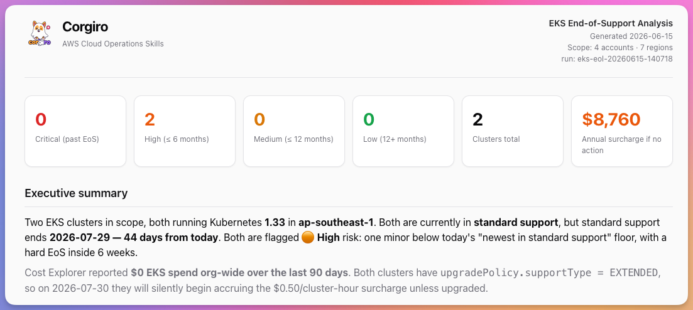

<div align="center">
  

# Corgiro - AWS Cloud Operations Skills

**An AWS TAM's operational playbook, one command away.**

[](LICENSE)
[](#)
[](#)

</div>

Corgiro is an AI agent skill for AWS multi-account cloud operations. One command sweeps your entire AWS Organization, read-only, and returns shareable reports.

Each sweep finds:

- **Account coverage gaps** - which accounts are reachable, newly added, or newly unreachable
- **AWS Health events** - org-wide risk assessment and pattern analysis
- **RDS / Aurora end-of-support** - risk-prioritized upgrade recommendations
- **Amazon EKS end-of-support** - Kubernetes version risk, upgrade paths, extended-support cost
- **EC2 compute hygiene** - instance generation, rightsizing signals, Graviton candidates, EBS optimization, security posture, snapshot coverage
- **IAM security risks** - admin sprawl, stale access keys, MFA gaps, root-account risks, keyless-auth remediation
- **Bedrock model deprecation** - which accounts and inference profiles still use at-risk models
- **RI / Savings Plans gaps** - coverage, utilization waste, purchase recommendations, expiring commitments
- **EKS ingress migration triage** - which clusters still need migration off NGINX, and the right path for each

Plus `/corgiro ask` for ad-hoc org-wide questions and `/corgiro mode-builder` to build your own modes.

Want the deeper explanation of how it works? See [docs/what-is-corgiro.md](docs/what-is-corgiro.md).

Reviewing Corgiro before you approve it? [docs/how-corgiro-accesses-your-account.md](docs/how-corgiro-accesses-your-account.md) covers the access model in full — the three setup paths, the IAM boundary and its explicit deny list, the external ID, session limits, auditability, and how to revoke.



## Quickstart

### Install the skill

```bash
npx skills@latest add aws-samples/sample-corgiro-aws-ops-skills
```

The CLI will detect your installed AI agents and prompt you to choose where to install.

### Setup Corgiro

Open your agent and run the one-time setup:

```
/corgiro setup-corgiro
```

### Run a sweep

Check which accounts are reachable:

```
/corgiro account-coverage
```

## Modes

| Invocation                                                                      | Description                                                                                                                                                                                                                         |
| ------------------------------------------------------------------------------- | ----------------------------------------------------------------------------------------------------------------------------------------------------------------------------------------------------------------------------------- |
| [`/corgiro setup-corgiro`](skills/corgiro/modes/setup-corgiro/)                 | One-time multi-account setup. Choose **path A** (use existing Identity Center access — no org changes), **path B** (org-wide cross-account access — trusted access, delegated admin, StackSet; sign in via Identity Center or an external SAML IdP), or **path C** (join a deployment a colleague already provisioned — no payer access needed). Saves state to `~/.corgiro/`. |
| [`/corgiro account-coverage`](skills/corgiro/modes/account-coverage/)           | Determine accounts in scope, probe reachability (SSO profile or AssumeRole), produce coverage report.                                                                                                                               |
| [`/corgiro health-event-analysis`](skills/corgiro/modes/health-event-analysis/) | AWS Health Dashboard analysis across your org or assigned accounts — risk assessment, pattern analysis, HTML report.                                                                                                                |
| [`/corgiro rds-eol-analysis`](skills/corgiro/modes/rds-eol-analysis/)           | RDS/Aurora end-of-support analysis — risk-prioritized report with upgrade recommendations.                                                                                                                                          |
| [`/corgiro eks-eol-analysis`](skills/corgiro/modes/eks-eol-analysis/)           | Amazon EKS end-of-support analysis — Kubernetes version risk, upgrade paths, and extended support cost estimates.                                                                                                                   |
| [`/corgiro ec2-compute-review`](skills/corgiro/modes/ec2-compute-review/)       | EC2 operational health assessment — instance type currency, Graviton eligibility, EBS optimization, security, CloudWatch utilization, and snapshot coverage.                                                                        |
| [`/corgiro iam-security-review`](skills/corgiro/modes/iam-security-review/)     | Org-wide IAM security review — overly permissive policies/roles, IAM users with admin-equivalent access (direct, inline, or via group), stale or unused access keys, MFA gaps, password policy, root-account risks, automation/CI users on long-lived keys with keyless-auth remediation, and Access Analyzer gaps.                       |
| [`/corgiro bedrock-model-lifecycle`](skills/corgiro/modes/bedrock-model-lifecycle/) | Bedrock model lifecycle analysis — identify deprecated or soon-to-be-deprecated models, which accounts still use them, and which inference profiles reference them.                                                              |
| [`/corgiro ri-sp-coverage-analysis`](skills/corgiro/modes/ri-sp-coverage-analysis/) | Reserved Instance and Savings Plans coverage analysis — spend decomposition, coverage, utilization, purchase recommendations, and expiring commitments across the org (payer-scoped).                                             |
| [`/corgiro eks-ingress-migration`](skills/corgiro/modes/eks-ingress-migration/)     | Org-wide EKS ingress migration triage — discovers clusters across accounts/regions, detects EKS Auto Mode, and classifies each cluster's ingress exposure from AWS load balancer tags (NGINX front vs AWS Load Balancer Controller ALB vs Auto Mode managed) to prioritize migration off NGINX and point each at the right path (Gateway API + lbc-migrate toolkit, ALB/LBC Ingress, or AWS Transform/ATX).                       |
| [`/corgiro ask <question>`](skills/corgiro/modes/ask/)                          | Ad-hoc org-wide questions — plans read-only AWS CLI calls from your natural-language question, shows the plan for approval (accounts, regions, call budget), fans out across all reachable accounts, and answers inline from live API data. Save a good run as a permanent mode via `mode-builder`. |
| [`/corgiro mode-builder`](skills/corgiro/modes/mode-builder/)                   | Interactive workflow to create custom Corgiro modes for your org — ideation, AWS API discovery, drafting, validation, and testing.                                                                                                  |

## Install

```bash
# Install the skill (interactive)
npx skills@latest add aws-samples/sample-corgiro-aws-ops-skills

# Install globally for Kiro CLI
npx skills@latest add aws-samples/sample-corgiro-aws-ops-skills -g -a kiro-cli -y

# Local development (symlink)
ln -s "$PWD/skills/corgiro" ~/.kiro/skills/corgiro
```

## Requirements

- AWS CLI v2, signed in via IAM Identity Center (SSO) — or, for paths B/C, an external SAML IdP (Azure AD/Entra ID, Okta, etc. via `aws-azure-login`, `saml2aws`, or similar)
- `~/.corgiro/config.json` (created by `setup-corgiro`)

For **paths B and C** (org-wide cross-account access) additionally:

- A dedicated tooling account with delegated admin for Health, Security Hub, GuardDuty, Config
- `CorgiroReadOnlyRole` deployed to member accounts via StackSet (path B deploys it; path C joins an existing deployment)

Run `/corgiro setup-corgiro` to set up any path. For what each path grants and how it is bounded, see [How Corgiro accesses your AWS accounts](docs/how-corgiro-accesses-your-account.md).

## Repo Layout

```
skills/
└── corgiro/
    ├── SKILL.md                          ← router (single command)
    ├── references/
    │   ├── cross-account-defaults.md     ← shared config defaults
    │   ├── credential-resolution.md      ← per-account credential dispatch
    │   ├── aws-version-lifecycle.md      ← EOL date scraping reference
    │   ├── report-format.md              ← shared report structure + theme
    │   └── glossary.md                   ← shared vocabulary
    ├── scripts/
    │   ├── preflight.sh                  ← pre-flight security checks (every mode)
    │   ├── inject-report-assets.py       ← splices CSS + logo into reports
    │   └── leak-scan.sh                  ← validation-gate scanner (mode-builder)
    ├── assets/
    │   ├── corgiro-readonly-role.yaml    ← member-account role CFN template (paths B/C)
    │   ├── corgiro-operator-role.yaml    ← tooling-account operator role CFN template (path B, SAML)
    │   ├── report-theme.css              ← shared report styling
    │   ├── corgiro-logo.png              ← logo (96×96 source)
    │   └── corgiro-logo.datauri          ← logo as data URI (inlined into reports)
    └── modes/
        ├── setup-corgiro/
        │   ├── MODE.md                   ← router: choose path A, B, or C
        │   └── references/
        │       ├── option-a-identity-center.md
        │       ├── option-b-cross-account.md
        │       ├── option-b-saml-external.md
        │       └── option-c-join-existing.md
        ├── account-coverage/
        │   └── MODE.md
        ├── health-event-analysis/
        │   ├── MODE.md
        │   └── references/
        │       └── ...
        ├── bedrock-model-lifecycle/
        │   └── MODE.md
        ├── eks-ingress-migration/
        │   └── MODE.md
        ├── mode-builder/
        │   ├── MODE.md
        │   └── references/
        │       ├── mode-template.md
        │       └── validation-checklist.md
        └── ...                           ← more modes
```

## Contributing

See [CONTRIBUTING.md](CONTRIBUTING.md) — repository architecture, where new content belongs, and how to submit changes.

## Disclaimer

This repository provides sample code for educational and demonstration purposes only. It is not intended for direct production use without proper review, testing, and validation. Always test generated infrastructure artifacts (Terraform, Helm charts, kubectl commands) in non-production environments first. Use at your own risk — the authors are not responsible for any issues, damages, or losses that may result from using this code in production.

## License

This project is licensed under the MIT-0 License. See the LICENSE file.
