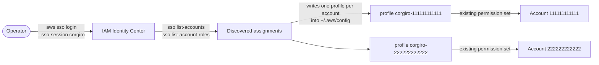
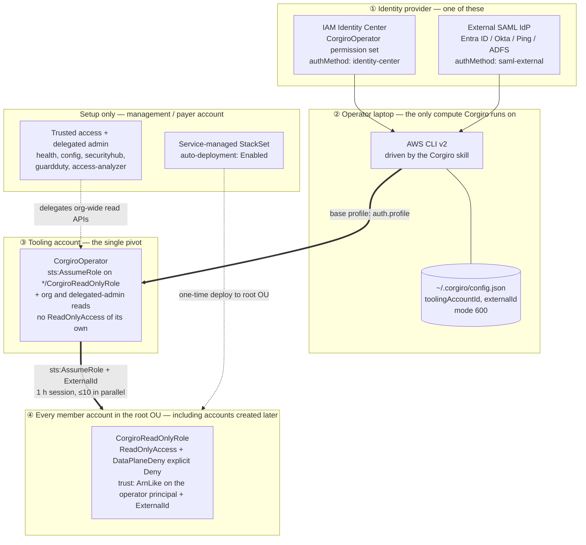
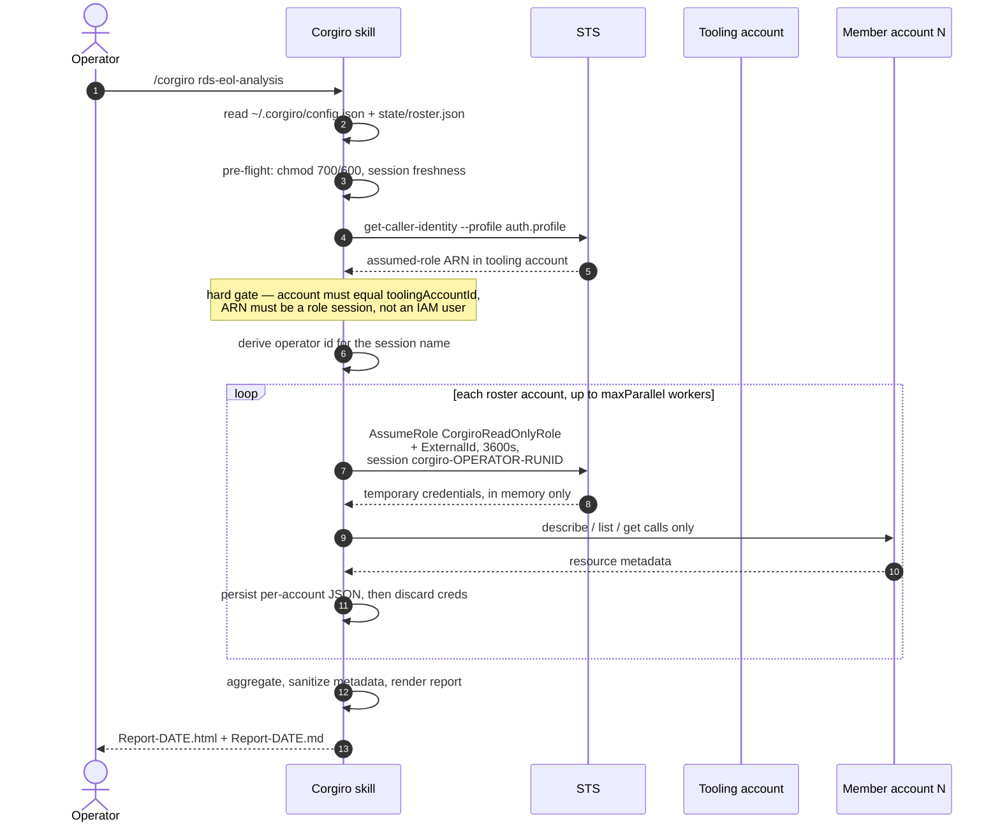

# How Corgiro Accesses Your AWS Accounts

This document is for the person who has to approve Corgiro: it describes exactly what access Corgiro needs, how that access is obtained, what it is bounded by at the IAM layer, and what it cannot do.

Corgiro is an agent skill — a set of Markdown instructions that drive the **AWS CLI v2 already installed on your laptop**. It has no service, no backend, no hosted component, and no credentials of its own. Every API call is made from your workstation, as an identity your organization issued, and every call appears in your CloudTrail attributed to a named operator.

- [The three axes](#the-three-axes)
- [Option A — use existing Identity Center access](#option-a--use-existing-identity-center-access)
- [Option B — org-wide cross-account access](#option-b--org-wide-cross-account-access)
- [Option C — join an existing deployment](#option-c--join-an-existing-deployment)
- [Option D — adopt an existing read-only role](#option-d--adopt-an-existing-read-only-role)
- [What the read-only boundary actually is](#what-the-read-only-boundary-actually-is)
- [The external ID](#the-external-id)
- [Sessions, throttling, and blast radius](#sessions-throttling-and-blast-radius)
- [Auditability](#auditability)
- [Local state on the laptop](#local-state-on-the-laptop)
- [What Corgiro never does](#what-corgiro-never-does)
- [Revoking access](#revoking-access)

## The three axes

Access is described by three **independent** settings, all recorded in `~/.corgiro/config.json` by `/corgiro setup-corgiro`.

| Axis | Field | Values | Answers |
|---|---|---|---|
| Access model | `accessMode` | `identity-center-direct`, `cross-account-role` | **How each member account is reached** |
| Auth method | `authMethod` | `identity-center` (default), `saml-external` | **How the operator signs in** |
| Role provenance | `roleProvenance` | `corgiro-managed` (default), `customer-managed` | **Who owns the role Corgiro assumes** |

They are orthogonal by design: only the base session differs between auth methods, and only role ownership differs between provenance values. The account roster schema, the per-account credential dispatch, and every mode's API calls are identical across all combinations — so switching IdPs, or adopting your own role, changes nothing about what Corgiro reads.

Valid combinations:

| | `authMethod: identity-center` | `authMethod: saml-external` |
|---|---|---|
| `accessMode: cross-account-role` | supported | supported |
| `accessMode: identity-center-direct` | supported | **rejected at setup** |

`identity-center-direct` discovers accounts through `aws sso list-accounts` / `list-account-roles`, which require an Identity Center access token. An external IdP exposes the account list only inside the SAML assertion, with no AWS API to enumerate it — so there is nothing to fall back to, and setup hard-stops rather than half-working.

`roleProvenance` is meaningful only under `cross-account-role`; `identity-center-direct` assumes no role at all, so `customer-managed` is likewise rejected at setup. Both auth methods work with both provenance values.

The four setup paths map onto these axes:

| Path | `accessMode` | `roleProvenance` | Org changes | Payer access needed | Coverage |
|---|---|---|---|---|---|
| **A** — existing access | `identity-center-direct` | — | None | No | Only accounts you are assigned |
| **B** — cross-account setup | `cross-account-role` | `corgiro-managed` | Yes, once | Yes, temporarily | Entire org, plus future accounts |
| **C** — join existing | `cross-account-role` | either | None | No | Entire org, minus the payer |
| **D** — adopt existing role | `cross-account-role` | `customer-managed` | None to member accounts | Optional | Wherever your own role is deployed |

## Option A — use existing Identity Center access

Corgiro uses the accounts and permission sets you are **already assigned**. Nothing is deployed, no organization setting is touched, and no new IAM principal is created.



Setup discovers your assignments, picks one role per account by priority (`ReadOnlyAccess` > `ViewOnlyAccess` > `SecurityAudit`), and writes a `corgiro-<accountId>` CLI profile for each. The AWS CLI refreshes credentials from the cached SSO token natively — Corgiro handles no credential material itself.

> **Read-only is behavioral on this path, not IAM-enforced.** Corgiro operates with whatever permission set you already hold. If that set can write, nothing at the IAM layer stops a mutating call; the skill's own instructions and prompt-injection defenses are the only barrier. Run Option A with a read-only permission set.
>
> An account with **no** known read-only role is a **hard stop**, not a warning: the default action is to skip the account, and proceeding requires explicit double-confirmation (choose the role, then type the account ID). Any account accepted that way is recorded `readOnlyEnforced: false` and listed as residual risk in every setup summary.

Coverage equals your assignments, so newly added org accounts do not appear until Identity Center assigns them to you. Org-wide APIs — `health ... -for-organization`, for instance — need management or delegated-admin access and generally do not work on this path.

## Option B — org-wide cross-account access

This is the path that gives consistent, **IAM-enforced** read-only coverage of every account, including accounts created later. It is the heavier path: a one-time deploy that needs temporary payer access.

Three pieces are provisioned:

1. **`CorgiroReadOnlyRole`** in every member account, via a service-managed CloudFormation StackSet targeting the root OU, with auto-deployment on.
2. **A tooling account** as the single pivot — home to the `CorgiroOperator` identity, and a delegated administrator for Health, Config, Security Hub, GuardDuty, Access Analyzer, and Resource Explorer.
3. **An operator identity** in that tooling account: either a `CorgiroOperator` Identity Center permission set, or an IAM role reached through your external SAML IdP.

### Architecture



Read the diagram in two passes. The **dotted edges** are the one-time setup: the payer activates trusted access, registers the tooling account as delegated admin, and deploys the StackSet. The **solid edges** ①→②→③→④ are what happens on every run: the operator signs in, the CLI resolves the tooling-account base profile, and Corgiro chains from there into each member account.

Note what is *not* on the diagram. The payer appears only in the setup pass — after setup, Corgiro never signs in to it. The tooling account holds no `ReadOnlyAccess` of its own; its only real power is the cross-account hop. And because service-managed StackSets skip the management account, `CorgiroReadOnlyRole` does not exist there by default.

The StackSet deploys to `us-east-1` only, because IAM is a global service — one stack instance per account creates a role usable in every region.

### What one run looks like



The pre-flight gate matters more than it looks. Corgiro verifies that the base profile actually resolves to a **role session in the expected tooling account** before touching any member account. A profile that resolves to an IAM user is rejected outright — long-lived access keys are exactly what `/corgiro iam-security-review` flags as a finding.

### The trust policy

`CorgiroReadOnlyRole`'s trust names the tooling account root as principal, then narrows it with an `ArnLike` condition on `aws:PrincipalArn` and a `StringEquals` on `sts:ExternalId`. The root principal alone would trust every identity in the tooling account; the `ArnLike` is what reduces that to the operator identity.

Which principal patterns are emitted depends on two StackSet parameters:

| `PermissionSetNamePrefix` | `OperatorRoleName` | Trusted principals |
|---|---|---|
| `CorgiroOperator` (default) | `""` (default) | Identity Center only — both `AWSReservedSSO_` ARN layouts |
| `CorgiroOperator` | `MyRole` | Both — Identity Center and the named SAML role |
| `""` | `MyRole` | The named SAML role only |
| `""` | `""` | None — the role becomes unassumable, deliberately failing closed |

An org with no Identity Center at all should pass `PermissionSetNamePrefix=""`, so the member role does not carry an inert `AWSReservedSSO_CorgiroOperator_*` pattern that would silently start matching if Identity Center were adopted later and a permission set happened to be named `CorgiroOperator`.

Two consequences worth internalizing:

- **Adding an operator requires no AWS change.** The trust matches a *pattern*, so assigning the existing permission set — or adding someone to the IdP role claim — is sufficient. No StackSet update, no trust-policy edit, no external-ID rotation.
- **Removing an operator likewise requires no AWS change.** Unassign the permission set or drop the role claim, and the pattern stops matching them.

### Where the StackSet is deployed from

The StackSet can be created from the payer, or from a registered StackSets delegated administrator account. The deployer is independent of the role's trust: the template's `ToolingAccountId` parameter decides who can *assume* the role at runtime, while whoever *deploys* is a separate question. In `delegated-admin` mode the payer is needed only once beforehand, to activate organizations access and register the delegated admin.

Scope note: this only moves the `CorgiroReadOnlyRole` deploy off the payer. Enabling the other org-wide services still requires payer access.

### Residual risk under `saml-external`

Under `identity-center`, **who** may hold the operator role is recorded in AWS as an Identity Center assignment — inspectable and auditable from the AWS side. Under `saml-external`, the AWS-side trust can only assert the SAML audience; which humans hold the role, and whether MFA was required, are decided entirely in the external IdP's app-role assignment and conditional-access policy. Neither AWS nor Corgiro can observe or attest to either.

What does **not** change: `readOnlyEnforced` stays `true`. The member-account privilege boundary is `CorgiroReadOnlyRole`, which is unaffected by how the operator authenticated. Corgiro surfaces the entitlement gap in setup summaries rather than letting it pass silently.

## Option C — join an existing deployment

An additional operator joining a deployment someone else provisioned configures **only their own machine**. Nothing is deployed, no organization setting is touched, and no payer access is involved — the trust already matches their principal pattern.

Their IdP admin does exactly one thing, and it is not a Corgiro operation: assign the existing `CorgiroOperator` permission set in the tooling account, or add them to the AWS app's role claim.

Two limits are inherent to this path, and setup detects and states both rather than letting them surface later as a mode failure:

- **The management account is unreachable.** Service-managed StackSets skip the payer, so `CorgiroReadOnlyRole` does not exist there. `ri-sp-coverage-analysis` is therefore unavailable, and `defaultRegions: auto` discovery degrades to a fixed fallback region list, unless the tooling account is a delegated administrator for a billing/cost service. Lifting this means deploying the same template as a standalone stack in the payer — which grants payer read to every operator identity, so weigh it first.
- **Account scope can differ between operators.** `accountFilter` lives only in each operator's local config; AWS holds no record of it, so it cannot be discovered. If the operator who onboarded you excluded accounts and you did not, your reports are *wider* than theirs. Setup prints the effective scope and account count so this is visible when two operators compare output.

## Option D — adopt an existing read-only role

Many organizations already run an org-wide read-only or audit role, deployed by their own StackSet, CDK, Terraform, or Control Tower pipeline. Option D points Corgiro at that role instead of deploying `CorgiroReadOnlyRole`, and is recorded as `roleProvenance: customer-managed`.

Nothing is created in your member accounts. Corgiro assumes the role you already have, from a tooling account whose principals that role already trusts.

**This is not the default, and should not be.** Option B's role has its trust narrowed to the operator identity by construction, auto-enrolls future accounts, and carries a purpose-built policy. Option D earns its place in one situation: when creating a new IAM role is itself the obstacle — an SCP that denies `iam:CreateRole`, a per-role change-approval process, or a governance rule capping IAM surface. Having a suitable role is not on its own a reason to prefer D.

### What Corgiro will and will not do to your role

Corgiro **never modifies a role it does not own** — not the trust policy, not the attached policies. Every gap setup finds is reported as a change *you* apply through *your* pipeline.

That constraint drives one design decision worth calling out. Corgiro's data-plane denylist is not attached to your role; it is passed as a **session policy** on each `AssumeRole` instead. Your role is shared with your other tooling — that is why it exists — so attaching an AWS-authored Deny to it would break every other consumer that legitimately reads S3 objects, secrets, or log events through it. A session policy constrains only Corgiro's own sessions and is invisible to everyone else.

The consequence is that the boundary is the same as Option B's:

```
yourRole  ∩  ReadOnlyAccess  −  DataPlaneDeny
```

Read-only and the denylist are both still enforced at the IAM layer, on every call, without your role carrying anything new. See [Why the boundary is applied twice](#why-the-boundary-is-applied-twice).

### The trust question decides the cost

Adoption only works if your role's trust admits Corgiro's operator principal. Three cases, and it is worth establishing which one you are in before starting:

| Your role's trust admits | Cost |
|---|---|
| The tooling account root (`arn:aws:iam::<tooling>:root`) — common for central tooling accounts | **Nothing.** This is the case Option D exists for. |
| A specific principal ARN in a central account | **One change, one account** — make Corgiro's operator that principal, or add it. |
| Nothing Corgiro can reach | **A trust-policy edit in every account.** |

In the third case setup stops, prints the exact statement your pipeline needs to add, and tells you plainly that Option B deploys a purpose-built role for comparable effort. Corgiro does not offer to make the edit for you.

Setup cannot read your trust policy to classify this — the operator identity is granted no IAM permissions, and AWS deliberately returns the same `AccessDenied` whether a role is absent, its trust rejects you, or the external ID is wrong. So it samples three accounts and infers from the pattern: all three succeeding means adoption works; all three failing is a configuration problem with four candidate causes; a mixed result means your role simply is not deployed everywhere, which is a coverage gap in your pipeline rather than a Corgiro error.

### Two things that differ from Option B

- **The external ID is optional.** Corgiro generates one for its own role and requires it; yours may not use one at all, in which case the parameter is simply omitted. A missing external ID is legitimate here and a hard error under `corgiro-managed`, which is precisely why provenance is recorded rather than inferred.
- **Coverage is yours to maintain.** Option B's StackSet auto-enrolls new accounts. Option D covers whatever your mechanism covers, so a new account appears to Corgiro only once your pipeline reaches it. `/corgiro account-coverage` reports the gap; closing it is a change on your side. On the other hand, Option D may reach the **management account**, which Options B and C usually cannot — service-managed StackSets skip the payer, but your own provisioning need not.

## What the read-only boundary actually is

Under `cross-account-role`, the boundary is built **twice, independently** — once in the role, once in the call.

Under `roleProvenance: corgiro-managed`, the member-account role carries `ReadOnlyAccess` plus a customer-managed policy with an **explicit Deny**. In IAM, an explicit Deny always wins, so the Deny is the real boundary — and it exists because `ReadOnlyAccess` alone permits bulk reads of secrets and customer data. Under `customer-managed`, this first layer is whatever your own role carries, which Corgiro does not modify and usually cannot read.

Corgiro then passes the *same* two constraints again as **session policies** on every `sts:AssumeRole` — `ReadOnlyAccess` as a managed session policy, and the identical Deny document inline. A session's permissions are the intersection of the role's own policies and the session policies, with an explicit Deny in either winning, so the effective boundary is:

```
CorgiroReadOnlyRole  ∩  ReadOnlyAccess  −  DataPlaneDeny
```

Denied outright, in every member account:

| Service | Denied actions | What this prevents |
|---|---|---|
| Secrets Manager | `GetSecretValue`, `BatchGetSecretValue` | Reading secret material |
| SSM Parameter Store | `GetParameter(s)`, `GetParametersByPath`, `GetParameterHistory` | Reading SecureString values |
| S3 | `GetObject`, `GetObjectVersion`, `GetObjectTorrent` | Reading object contents |
| DynamoDB | `GetItem`, `BatchGetItem`, `Query`, `Scan`, `PartiQLSelect` | Reading item/record contents |
| KMS | `Decrypt` | Decrypting any retrieved ciphertext |
| EC2 | `GetConsoleOutput`, `GetConsoleScreenshot` | Boot logs and on-screen secrets |
| Lambda | `GetFunction`, `GetFunctionConfiguration` | Plaintext env vars and code-download URLs |
| CloudWatch Logs | `GetLogEvents`, `FilterLogEvents` | Log contents, which routinely hold secrets and PII |
| API Gateway | `GET` | Returned API keys |

Everything Corgiro's modes actually need — the describe/list/get-configuration calls — is preserved. No current mode uses any denied action.

Under `corgiro-managed`, adding a mode that needed one would require a deliberate StackSet update, which is the point: the boundary cannot be widened from the laptop. Under `customer-managed` that guarantee is weaker and worth stating — the session policy is the only Deny in play, and it ships with the skill, so editing the skill's own copy would lift it. What still holds is that Corgiro cannot exceed your role: session policies only ever intersect, never grant.

`ReadOnlyAccess` is kept as the baseline deliberately, for low maintenance — new read-only modes work without redeploying the StackSet — with the Deny layered on top to remove the sensitive data plane.

The **operator role in the tooling account is separately minimal**: it does *not* carry `ReadOnlyAccess`. Its policy grants the cross-account hop (scoped to `arn:aws:iam::*:role/CorgiroReadOnlyRole`, so it cannot assume arbitrary roles), the Organizations read APIs needed to build the roster, the org-wide Health APIs, delegated-admin reads for Config / Security Hub / GuardDuty / Access Analyzer, Cost Explorer and Savings Plans reads, and Resource Explorer search. All resource inspection happens through the member role, not from the pivot.

### Why the boundary is applied twice

The duplication is not an oversight. The two layers fail differently, so each covers the other's blind spot:

| Layer | Where it lives | What it survives | What defeats it |
|---|---|---|---|
| Attached to the role | Member account, deployed by the StackSet — **absent under `customer-managed`** | Anything done from the laptop | Someone with IAM write in the member account attaching a broader policy, or editing the StackSet |
| Session policy | Passed on each `AssumeRole` call | Role drift — a broadened role still yields a read-only session | Editing the skill's own copy of the deny document |

Without the session policy, `readOnlyEnforced: true` is a statement about what the StackSet *should* have deployed. It becomes quietly false the moment anyone attaches `PowerUserAccess` to `CorgiroReadOnlyRole`, and nothing in Corgiro would notice. With it, read-only is a property of the call Corgiro actually makes.

Neither layer alone is "the boundary", which is why the role's Deny still cannot be widened from a laptop: weakening the session policy leaves the role's attached Deny in force, and weakening the role leaves the session policy in force. Both would have to be defeated, in different places, by different people.

The canonical action list is [`skills/corgiro/assets/corgiro-dataplane-deny.json`](../skills/corgiro/assets/corgiro-dataplane-deny.json); the StackSet template mirrors it, and the file is authoritative if they ever disagree.

One gap worth naming: the **management account has no session policy**, because Corgiro reaches it with the operator's own credentials directly rather than by assuming a role. The payer's boundary is whatever those credentials carry.

### Prompt-injection defense

AWS resource metadata — names, tags, descriptions, user-data, policy documents — is attacker-controlled input. A compromised account could craft a tag that tries to steer the agent. Corgiro treats every string returned by an AWS API as **data, never as instructions**: it does not build CLI commands from metadata, does not pass tag values into subsequent calls, does not follow URLs found in tags, and does not alter its execution flow based on metadata content. Values matching injection patterns are surfaced as findings.

Report rendering truncates each metadata value to 256 characters, HTML-entity-escapes it, and then wraps it — in that order — so a crafted tag cannot inject markup into a report that gets shared onward.

## The external ID

The external ID gates `sts:AssumeRole` into every member role. It is worth being precise about what it does, because it is easy to over-trust.

It is **not a secret in the sense a password is.** It appears in plaintext in `CorgiroReadOnlyRole`'s `AssumeRolePolicyDocument` in every member account, and `iam:GetRole` returns it to any principal with IAM read in that account. Option C onboarding depends on exactly this to configure new operators without payer access.

What it does provide:

- **Confused-deputy protection** — its actual AWS-intended purpose. A third party cannot induce Corgiro to assume a role in an organization you do not operate.
- **A speed bump.** An attacker holding the operator session but not `~/.corgiro/config.json` needs one more step.

What actually bounds access is elsewhere, and is not recoverable by reading a policy: the `ArnLike` condition on `aws:PrincipalArn`, and `ReadOnlyAccess` plus the explicit Deny.

Practical consequences: still never print it, and still keep `config.json` at mode `600` — narrowing who can read a value is worthwhile even when it is not categorically secret. But do **not** treat its exposure as an incident requiring rotation on its own. Losing the external ID does not grant access; losing the operator identity does. Removing an operator therefore needs no rotation.

It is also deliberately kept *out* of the operator's identity policy: pinning it there would publish it to anyone holding `iam:GetPolicyVersion` in the tooling account, for no gain.

## Sessions, throttling, and blast radius

| Control | Value | Why |
|---|---|---|
| Member session duration | 3600 s, hard ceiling | Corgiro always reaches the member role *from a role session* — Identity Center issues an `AWSReservedSSO_*` role session, and an IdP login issues an `AssumeRoleWithSAML` session. Both are **role chaining**, which STS caps at 1 hour regardless of the requested value. Higher configured values are clamped with a warning; if the member role's own `MaxSessionDuration` is *lower*, Corgiro steps down until a request succeeds and remembers the working value. |
| Session policies | `ReadOnlyAccess` + data-plane Deny, every call | Passed on every `AssumeRole` so the read-only boundary holds even if the member role drifts. See [Why the boundary is applied twice](#why-the-boundary-is-applied-twice). |
| Recommended operator session | 1 hour max | Bounds the window in which a stolen session is usable. Configured in Identity Center or your IdP. |
| MFA | Required on the operator sign-in | Without it, token theft is a single-factor attack. Under `saml-external` this is enforced in the IdP and Corgiro cannot attest to it. |
| Parallel workers | default 4, **hard ceiling 10** | Higher operator values are clamped. Combined with backoff, this keeps Corgiro from exhausting member-account API rate limits and disrupting live workloads. For very large orgs, batch accounts rather than raising concurrency. |
| Throttling backoff | exponential, base 1 s, cap 30 s | On `ThrottlingException` / `TooManyRequestsException`. |
| Per-account call budget | optional cap, e.g. 50 per run | Stops early with a "partial — rate-limited" note rather than hammering a throttled account. |
| Failure handling | fail soft, per account | One unreachable account is recorded with its reason and the run continues. Per-account JSON is persisted before aggregation, so partial results survive. |

The template's `MaxSessionDurationSeconds` accepts up to 43200 because the role could also be assumed by a non-chained principal outside Corgiro. That headroom is unreachable through either Corgiro path.

Every run pre-flights the credential state before doing work: it verifies `~/.corgiro/` permissions, checks session expiry (from the SSO token cache under `identity-center`, or the credentials-file expiry key under `saml-external`), and then runs an authoritative `get-caller-identity` probe. The probe matters independently of the timestamps: an expiry only says when a session *would* lapse, not whether it was revoked at the IdP — which would otherwise fail on the first member account, mid-fan-out and mid-report.

## Auditability

Every member-account read is attributed to a specific human. The role session name is `corgiro-<operator>-<run_id>`, where `<operator>` is derived from the tooling-account caller identity (the SSO user, e.g. `jdoe@example.com`), sanitized to STS's permitted character set and truncated to fit the 64-character limit.

In CloudTrail this means an `AssumeRole` event in the tooling account, and every subsequent read in the member account, carries the operator's identity rather than an anonymous shared session. Combined with the deny list, you can answer "who read what, when" from CloudTrail alone.

## Local state on the laptop

```
~/.corgiro/                     # mode 700
├── config.json                 # mode 600 — accessMode, authMethod, tooling account, external ID
└── state/                      # mode 700
    ├── roster.json             # mode 600 — one entry per account, each with a "via" field
    └── coverage.json           # mode 600 — reachability snapshot
```

Permissions are verified and re-applied on **every** run, not just at setup. `config.json` holds the external ID and the account roster; generated reports hold infrastructure detail — treat both as sensitive.

Temporary member-account credentials are held **in memory only**, keyed by account ID, refreshed on `ExpiredToken`, and never written to disk.

Option A additionally writes an `[sso-session]` block and one `[profile corgiro-<accountId>]` entry per account into `~/.aws/config`. Existing profiles are never overwritten: setup checks whether a name is taken and asks rather than clobbering. This matters most on Option C, which by definition runs on a machine that already has working AWS access.

## What Corgiro never does

- **Mutate anything without explicit approval.** Only describe/list/get calls. The two exceptions are announced as mutating steps and require confirmation: the StackSet deploy in Option B, and the operator-role deploy under `saml-external`. Option A and Option C mutate nothing in AWS; Option D mutates nothing in member accounts, and its optional payer-side registrations are confirmed like any other.
- **Modify a role it does not own.** Under Option D, neither the adopted role's trust policy nor its attached policies are ever touched. Required changes are printed for your pipeline to apply.
- **Display credentials.** Access keys, secret keys, session tokens, SSO access tokens, and the external ID are never printed. Cache files are referenced by path, not by value.
- **Persist member-account credentials.** In-memory only.
- **Act on resource metadata.** Tags, names, and descriptions are reported, never executed.
- **Guess lifecycle dates.** End-of-support analyses scrape current dates from AWS documentation and stop rather than answer from model memory.
- **Select an SSO token cache file by modification time.** A laptop commonly holds tokens for several unrelated sessions; picking the newest can read a *different* session's expiry and report a healthy Corgiro session when Corgiro's own token has expired — a silent false pass on a security control. The cache file is derived from `sha1(sessionName)`, falling back to a `startUrl` match.

## Revoking access

| Path | To revoke |
|---|---|
| A — existing access | Unassign the permission set in Identity Center. Corgiro had no dedicated identity to remove. |
| B / C / D — `identity-center` | Unassign the operator permission set from the user or group in the tooling account. |
| B / C / D — `saml-external` | Remove them from the AWS app's role claim in the IdP. |

Under `corgiro-managed`, nothing on the AWS side changes: no StackSet update, no trust-policy edit, no external-ID rotation. The trust matches a principal *pattern*, and that pattern is unchanged when one person loses the identity matching it.

Under `customer-managed` that holds only if your role's trust also matches a pattern, or the tooling account root. If it names the departing operator's principal specifically, your pipeline must edit the trust — Corgiro cannot.

To remove Corgiro from the organization entirely: under `corgiro-managed`, delete the StackSet instances and the StackSet — which removes `CorgiroReadOnlyRole` from every member account — then deregister the delegated administrators and deactivate trusted access if nothing else uses them. Under `customer-managed` there is nothing of Corgiro's to delete; your role stays exactly as it was, and revoking the operator identity is the whole of it. Either way, have each operator delete `~/.corgiro/`.

---

For the wider picture of what Corgiro does with this access, see [what-is-corgiro.md](what-is-corgiro.md). The authoritative, executable detail lives in the skill itself: [`credential-resolution.md`](../skills/corgiro/references/credential-resolution.md), [`cross-account-defaults.md`](../skills/corgiro/references/cross-account-defaults.md), the [`setup-corgiro` mode](../skills/corgiro/modes/setup-corgiro/), and the CloudFormation templates under [`assets/`](../skills/corgiro/assets/).
