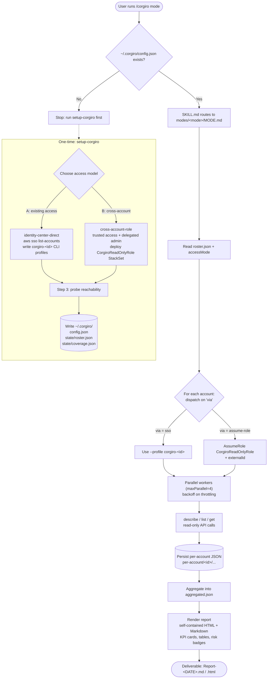

# What is Corgiro?

Corgiro is an **AI agent skill for AWS multi-account cloud operations**. It packages an AWS TAM's operational playbook into a single command that sweeps an entire AWS Organization for coverage gaps, Health events, end-of-support (EOS) risk, and compute health - and returns self-contained HTML/Markdown reports you can act on.

It installs as one command:

```
/corgiro <mode-name>
```

Every workflow is **read-only by default** (only `describe`/`list`/`get` calls unless you explicitly approve a mutating step), and every check is curated from real AWS Technical Account Manager experience. The goal is to put an expert's "keep accounts healthy" playbook one command away.

# The Benefits of Corgiro

- **Whole-organization visibility in one command.** Instead of clicking through accounts one at a time, a single `/corgiro <mode>` fans out across every reachable account and aggregates the result.
- **Read-only and safe by design.** The skill defaults to `describe`/`list`/`get` calls only. Any create/update/delete action requires explicit user approval, and credential(access keys, session tokens, the external ID) are never displayed.
- **A curated TAM playbook, not raw API calls.** Each mode encodes the judgment of an experienced operator - what to check, how to score risk, and what remediation to recommend.
- **Accurate, sourced findings.** EOS analyses never use model "memory" for lifecycle dates - they scrape current dates from AWS documentation and stop rather than guess if scraping fails.
- **Actionable deliverables.** Modes render self-contained HTML + Markdown reports with Corgiro branding, KPI cards, tables, and risk badges - shareable with no extra runtime.
- **Two access models for any operator.** Use the access you already have (no org changes), or provision consistent org-wide read-only coverage. Downstream modes behave identically under either model.
- **Future accounts come along for free.** Under the cross-account model, the read-only role auto-deploys to new accounts, and `account-coverage` flags newly added or newly-unreachable accounts on every run.

# How Corgiro Works

Corgiro is a router skill. `SKILL.md` parses the first token of your `/corgiro <args>` command as the **mode name** and dispatches to `modes/<mode-name>/MODE.md`, reading that mode's `references/` as needed. It reads configuration from two places:

1. **Operator config** - `~/.corgiro/config.json` (per-laptop, written by `setup-corgiro`).
2. **Distributed defaults** - embedded in mode references (for example `references/cross-account-defaults.md`).

If `~/.corgiro/config.json` does not exist, Corgiro stops and tells you to run `setup-corgiro` first.

## The setup procedure

Run `/corgiro setup-corgiro`. Setup chooses one of two access models and records it as `accessMode` in `~/.corgiro/config.json`:

| Path                                           | Choose when                                                                                            | What it does                                                                                    | Org changes                                         | Coverage                          |
| ---------------------------------------------- | ------------------------------------------------------------------------------------------------------ | ----------------------------------------------------------------------------------------------- | --------------------------------------------------- | --------------------------------- |
| **Existing access** (`identity-center-direct`) | You already sign in via IAM Identity Center and just want Corgiro to use the accounts you are assigned | Discovers your assigned accounts/roles, writes per-account CLI profiles                         | None                                                | Accounts you are assigned         |
| **Cross-account setup** (`cross-account-role`) | You administer the org and want full, consistent read-only coverage of every account                   | Enables trusted access + delegated admin, deploys `CorgiroReadOnlyRole` org-wide via a StackSet | Yes (needs temporary payer + Identity Center admin) | Entire org (plus future accounts) |

**Setup steps:**

- **Step 0 - Choose access model.** If a config already exists, Corgiro offers reconfigure / switch / cancel. Otherwise it asks you to pick **Existing access** or **Cross-account setup** (it never guesses).
- **Step 1 - Identity Center session.** **Existing access** ensures an SSO session named `corgiro` exists and logs in. **Cross-account setup** skips login here (the `CorgiroOperator` permission set does not exist yet) and proceeds with temporary payer access.
- **Step 2 - Run the chosen path** (reads only the one relevant reference):
  - **Existing access** discovers assigned accounts via `aws sso list-accounts`, lists roles per account, auto-picks a read-only role by priority (`ReadOnlyAccess` > `ViewOnlyAccess` > `SecurityAudit`), and writes one `corgiro-<accountId>` CLI profile per account into `~/.aws/config`.
  - **Cross-account setup** enables trusted access and delegated admin for the relevant service principals (Health, Config, Security Hub, GuardDuty, and more), deploys the `CorgiroReadOnlyRole` CloudFormation StackSet to the whole org root OU (gated by an external ID), creates the `CorgiroOperator` permission set, and configures the laptop.
- **Step 3 - Validate access and finalize** (common to both paths). Corgiro confirm `config.json` and `roster.json` were written, then runs an inline reachability probe - `aws sts get-caller-identity` against every account - and writes `coverage.json`. This makes downstream modes work immediately, with no separate validation step.

**Setup writes three files under `~/.corgiro/`:**

```
~/.corgiro/
├── config.json              # accessMode, ssoSession, identityCenter | crossAccount
└── state/
    ├── roster.json          # one entry per account, each with a "via" field
    └── coverage.json        # reachability snapshot from the Step 3 probe
```

## How Corgiro maintains the account roster

The roster (`~/.corgiro/state/roster.json`) is the cross-session source of truth for which accounts are in scope and how to reach each one. Every entry carries a `via` field so that downstream modes are **access-mode-agnostic**:

```json
{
  "111111111111": { "name": "prod-app", "role": "ReadOnlyAccess", "via": "sso" }
}
```

- `via: "sso"` - **Existing access**; credentials come from the `corgiro-<accountId>` CLI profile.
- `via: "assume-role"` - **Cross-account setup**; credentials come from assuming `CorgiroReadOnlyRole`.

**Ownership and refresh rules differ by access mode:**

- **`identity-center-direct` (Existing access):** the roster is **owned by `setup-corgiro`**. It reflects exactly the accounts you are assigned in Identity Center. To pick up newly assigned accounts you re-run `setup-corgiro`, which re-discovers via `aws sso list-accounts`. `account-coverage` refreshes reachability flags only - it does not add or remove accounts in this mode.
- **`cross-account-role` (Cross-account setup):** the roster is **authoritative from the org**. `account-coverage` pulls the full org list via `aws organizations list-accounts`, filters to `ACTIVE` accounts, applies the include/exclude `accountFilter`, and writes every discovered account with `via: "assume-role"`.

**Keeping it fresh - the `account-coverage` mode.** Running `/corgiro account-coverage`:

1. Reads `accessMode` and builds the candidate account list (from the roster for **Existing access**, or a fresh org pull for **Cross-account setup**).
2. Probes each account's reachability using the shared credential-resolution logic and categorizes it (`reachable`, `auth_expired`, `not_in_scope`, `role_missing`, `trust_mismatch`, `suspended`, `management`).
3. **Diffs against the previous snapshot** to surface new accounts (in scope since last time) and removed accounts (no longer in scope).
4. Generates a coverage report and updates `roster.json` (per the ownership rules above) and `coverage.json`.

## How Corgiro does multi-account

Every analysis mode reuses the same fan-out engine, described in `references/credential-resolution.md` and `references/cross-account-defaults.md`:

1. **Resolve credentials per account by dispatching on `via`:**
   - `via: "sso"` runs the CLI with `--profile corgiro-<accountId>`; the CLI refreshes credentials from the cached SSO token automatically.
   - `via: "assume-role"` calls `sts:AssumeRole` for `arn:aws:iam::<accountId>:role/CorgiroReadOnlyRole` from the tooling-account session, gated by the external ID, for a 3600-second session. Credentials are cached in memory per account and refreshed on `ExpiredToken`.
2. **Run in parallel with backoff.** Up to `maxParallel` (default 4) concurrent workers, with exponential backoff on throttling (`ThrottlingException` / `TooManyRequestsException`, base 1s, capped at 30s).
3. **Optionally scope regions first.** Cost-aware modes (such as `rds-eol-analysis`) can use Cost Explorer to find only the account/region combos that actually have spend for the service, avoiding empty probes. (Cost Explorer is a payer-level API, so under Option A you typically pass an explicit region list instead.)
4. **Persist per-account, then aggregate.** Each account's raw JSON is written under `per-account/<account_id>/...` before being rolled up into an `aggregated.json` and the final report. This keeps partial results if any single account fails.
5. **Fail soft per account.** If one account cannot be reached, Corgiro skips it, records the reason in the report (using the credential-resolution failure table), and continues with the rest - nothing runs blind.

## The flow


